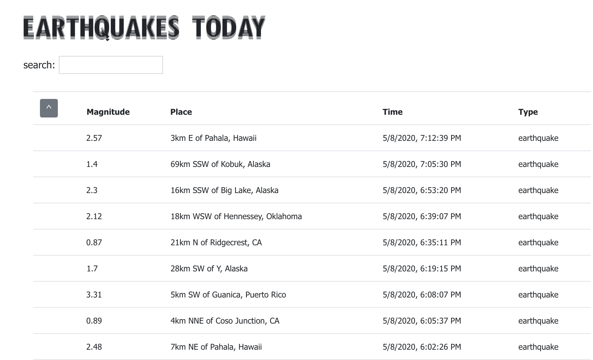

## Quake Directory
An app that lists earthquakes and anything that registers on the richter scale on the date you visit the site. Sort by magnitude and search for your location (best by state) to see what's happening near you. 

## Table of Contents
* [Installation](#installation)
* [Links](#links)
* [Author](#author)

## Installation

Run npm install and make sure to install dependencies

## Links

Deployed app: https://seeshell.github.io/earthquakes-today/

## Author

Email: 323seeshell@gmail.com